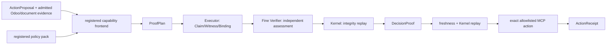

# Compiler v1 delivery plan

## Non-negotiable proof boundary

Registered code may admit sources and policy, derive provenance-preserving business facts, and lower a registered capability into a `ProofPlan`. It must never manufacture `Claim`, `Witness`, `Binding`, assessment, or final proof terms.

Every `CHECK` follows one authoritative path:

```text
registered ProofPlan
  -> Executor grounds Claims and computes Witnesses
  -> Fine Verifier independently assesses the submission
  -> Kernel replays integrity and commits or rejects the CHECK
```

The only deterministic shortcut is skipping the model Task Compiler when a tested capability already defines what must be proved. A deterministic document parser may also expose admitted facts or obligations. Neither case may create proof terms: Executor, Fine Verifier, and Kernel are never skipped for any `ProofPlan`.

## Phases and close gates

1. **Honest semantic model** — one canonical sales-order acceptance capability, derived facts with field-level provenance, no synthetic `sale.order` fields, and fail-closed proposal/source identity.
2. **Evidence types** — raw Odoo records, policy/document inputs, derived facts, and provenance remain distinguishable through Evidence IR and proof lineage.
3. **Narrow Odoo admission** — admit only the schema/read closure needed by the registered capability; no generic Odoo wrapper or write path.
4. **Durable child run** — Tau can start, inspect, pause, correct, and resume a registered ProofPlan without allowing the Manager to author policy or proof contracts.
5. **Proof-path enforcement** — tests prove every registered CHECK invokes Executor and Fine Verifier before Kernel; tampering or bypass fails closed.
6. **Freshness and receipt** — bind proposal, source snapshot, policy, and record revisions; recheck before action and record the resulting action receipt.
7. **One real vertical slice** — run one sales-order acceptance task end to end and retain raw model, child-run, proof, freshness, action, and benchmark receipts.
8. **Second capability test** — add a materially different capability without changing Runtime, Fine Verifier, or Kernel.

Each phase closes only after focused deterministic tests, one bounded real-model compatibility probe where model behavior is involved, and an independent read-only audit accepts the phase. A failed gate is fixed at its shared root before later phases continue.

## Scope guard

No MCP fusion, UI work, Compiler/Manager rewrite, verifier weakening, broad Odoo ontology, generic policy DSL, dashboard, or benchmark sweep belongs in this delivery. At most one complete benchmark evaluation is allowed in Phase 7.

## Completed architecture



The registered frontend owns only admission, provenance-preserving derived facts,
policy lookup, action contracts, and plan lowering. `Executor` owns proof-term
construction; `Fine Verifier` owns semantic assessment; `Kernel` owns proof
closure. Task Compiler is skipped only on this registered lane.

## Phase completion record

| Phase | Result | Closure evidence |
|---|---|---|
| 1. Honest semantic model | PASS | canonical sales-order acceptance view; proposal/source identity fails closed |
| 2. Evidence types | PASS | Odoo, document, policy and derived evidence retain typed provenance and stable snapshot hashes |
| 3. Narrow Odoo admission | PASS | only the required read/schema closure is admitted; persistent and benchmark Odoo remain separate |
| 4. Durable child run | PASS | Tau child run preserves events, checkpoints, SQLite session and raw reasoning across correction/resume |
| 5. Proof-path enforcement | PASS | every CHECK invokes Executor and Fine Verifier; fresh Kernel replay rejects tampering or bypass |
| 6. Freshness and receipt | PASS | proposal/source/policy/revisions are rechecked before an exact action; receipts bind raw MCP output |
| 7. Real vertical slice | PASS | ERP-Bench 2032: 8 CHECKs, 8 Executor + 8 Fine Verifier calls, 8 MCP actions, original verifier score 100 |
| 8. Second capability | PASS | vendor-bill posting: 1 CHECK through the unchanged Runtime/Fine Verifier/Kernel, `COMMITTED/SUPPORTED` |

Independent phase audits accepted all eight gates. The Phase 7 receipt is under
`tests/compiler_v1/artifacts/phase7/probe_20260830T223631Z_0c7cb652/`; the Phase
8 receipt is under `tests/compiler_v1/artifacts/phase8/20260830T231630Z/`.

## Proven boundary

Phase 8 proves that a materially different, already-admitted vendor-bill view can
reuse the proof backend without a Runtime, Fine Verifier, or Kernel branch. It
does not yet prove production ingestion of arbitrary vendor documents. Adding
that admission path is a separate decision, not unfinished proof machinery.
